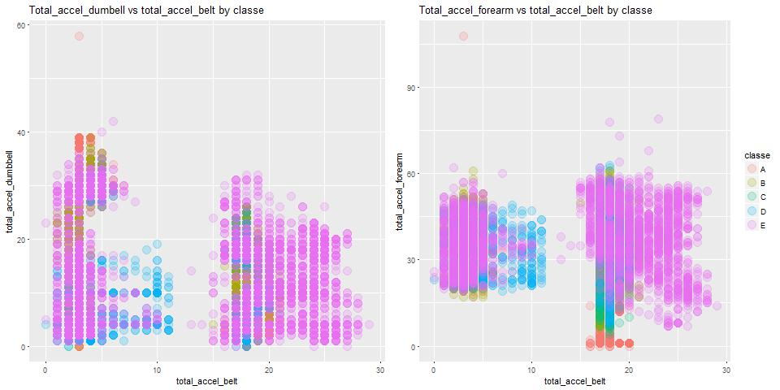

Introduction
===================

Using devices such as Jawbone Up, Nike FuelBand, and Fitbit it is now possible to collect a large amount of data about personal activity relatively inexpensively. These type of devices are part of the quantified self movement – a group of enthusiasts who take measurements about themselves regularly to improve their health, to find patterns in their behavior, or because they are tech geeks. One thing that people regularly do is quantify how much of a particular activity they do, but they rarely quantify how well they do it. In this project, your goal will be to use data from accelerometers on the belt, forearm, arm, and dumbell of 6 participants. They were asked to perform barbell lifts correctly and incorrectly in 5 different ways. More information is available from the website here: http://groupware.les.inf.puc-rio.br/har (see the section on the Weight Lifting Exercise Dataset).

Packages and functions
===================

    library(ggplot2) #To graphs

Load and preprocess data
===================

The following code allows select features according to accelerometers on
the belt, forearm, arm and dumbell and outcome feature (classe)

    #Read data sets
    bdtraining <- read.csv("pml-training.csv")
    bdtest <- read.csv("pml-testing.csv")

    #Select features according to accelerometers on the belt, 
    #forearm, arm and dumbell and outcome feature
    selectVector <- grepl("accel|classe", names(bdtraining))

    #New Training data
    bdtraining <- bdtraining[,selectVector]

    #Investagate features with NAs
    NAvector <- sapply(bdtraining, function(x){
            sum(is.na(x))
    })

    #Selection vector
    SeleVec <- NAvector==0

    #Elimanate features with NAs
    bdtraining <- bdtraining[,SeleVec]

    #Select adecuate variables in test data set

    #Select features according to accelerometers on the belt, 
    #forearm, arm and dumbell and outcome feature
    selectVector <- grepl("accel", names(bdtest))

    #New Training data
    bdtest <- bdtest[,selectVector]

    #Investagate features with NAs
    NAvector <- sapply(bdtest, function(x){
            sum(is.na(x))
    })

    #Selection vector
    SeleVec <- NAvector==0

    #Elimanate features with NAs
    bdtest <- bdtest[,SeleVec]

Algorithm selection
===================

The following figure, \[plot1\], shows two exploratory graphs that allow
to decide quickly which supervised algorithm to choose. The one on the
left side shows the relationship between two independent variables
(total\_accel\_dumbbell vs total\_accel\_belt) for each degree in the
quality of the execution of the curls (result variable). It is observed
that the classifier to be trained must be non-linear, since class E is
grouped in different aréas in the plane formed by the two independent
variables mentioned above, one or two lines would not be enough to make
an adequate classification. In the figure on the right side the same
thing happens.

We select the supervised algorithm: SVM. This algorithm is
adequate to deal with the nonlinear problem that lies ahead.

The following code produces the exploratory chart

    g1 <- ggplot(bdtraining, aes(x=total_accel_belt, y=total_accel_dumbbell,
                           col=classe)) +
            geom_point(alpha = 0.2, lwd = 5)+
            theme(legend.position="none") + 
            ggtitle("Total_accel_dumbell vs total_accel_belt by classe")

    g2 <- ggplot(bdtraining, aes(x=total_accel_belt, y=total_accel_forearm,
                                 col=classe)) +
            geom_point(alpha = 0.2, lwd = 5) + 
            ggtitle("Total_accel_forearm vs total_accel_belt by classe")

    multiplot(g1,g2, cols =2)

Model fit
=========

The **e1071** library was used to estimate a SVM Algorithm. 5-folds
cross validation were applied to determine the cost and gamma parameters
of the svm function producing the lowest k-fold Cross Validation error
rate. You can do this automatically using the tune function of the e1071
library, but it is very expensive computationally since it executes
10-folds cross validation. If you are interested in such automation, the
following code produces it.

    tune_output <- tune(svm, classe ~ .,
                        data = bdtraining,
                        kernel = "radial",
                        ranges = list(cost = c(0.01, 0.1, 1, 10, 100),
                                      gamma = c(0.5, 1, 2)))

If you want more information on how the tune() function is applied when
estimating a SVM see the book: "Introduction to statistical learning
with application in R".

Due to the high computational cost, I decided to estimate one SVM for
each parameter. If it was done manually since the tune () function could
not be executed due to the large number of huge objects being created.
The manual form took approximately two hours. The following code shows
that the best SVM corresponds to one with cost = 10 and gamma = 1, since
it produces the lowest 5-fold Cross Validation Error, iqual to 4.122923

    #Fit SVM algorithm whit Cost = 10
    #and gamma 1
    set.seed(4621)
    svmfit <- svm(classe ~ ., data = bdtraining,
                   kernel="radial", cost = 10, gamma=1,
                   scale = TRUE,
                   cross = 5)

    #K fold CV error = 4.122923
    100 - svmfit$tot.accuracy

Error test (Quiz prediction)
============================

When evaluating the SVM by training in the test database, bdtest, the
following predictions are produced:

<table>
<thead>
<tr class="header">
<th align="right">Observation_from_bdtest</th>
<th align="left">Prediction</th>
</tr>
</thead>
<tbody>
<tr class="odd">
<td align="right">1</td>
<td align="left">B</td>
</tr>
<tr class="even">
<td align="right">2</td>
<td align="left">A</td>
</tr>
<tr class="odd">
<td align="right">3</td>
<td align="left">B</td>
</tr>
<tr class="even">
<td align="right">4</td>
<td align="left">A</td>
</tr>
<tr class="odd">
<td align="right">5</td>
<td align="left">A</td>
</tr>
<tr class="even">
<td align="right">6</td>
<td align="left">E</td>
</tr>
<tr class="odd">
<td align="right">7</td>
<td align="left">D</td>
</tr>
<tr class="even">
<td align="right">8</td>
<td align="left">B</td>
</tr>
<tr class="odd">
<td align="right">9</td>
<td align="left">A</td>
</tr>
<tr class="even">
<td align="right">10</td>
<td align="left">A</td>
</tr>
<tr class="odd">
<td align="right">11</td>
<td align="left">B</td>
</tr>
<tr class="even">
<td align="right">12</td>
<td align="left">C</td>
</tr>
<tr class="odd">
<td align="right">13</td>
<td align="left">B</td>
</tr>
<tr class="even">
<td align="right">14</td>
<td align="left">A</td>
</tr>
<tr class="odd">
<td align="right">15</td>
<td align="left">E</td>
</tr>
<tr class="even">
<td align="right">16</td>
<td align="left">E</td>
</tr>
<tr class="odd">
<td align="right">17</td>
<td align="left">A</td>
</tr>
<tr class="even">
<td align="right">18</td>
<td align="left">B</td>
</tr>
<tr class="odd">
<td align="right">19</td>
<td align="left">B</td>
</tr>
<tr class="even">
<td align="right">20</td>
<td align="left">B</td>
</tr>
</tbody>
</table>

The precision in the prediction is equal to 100%. 

The follow code produce predictions:

    predict(svmfit,newdata = bdtest)
